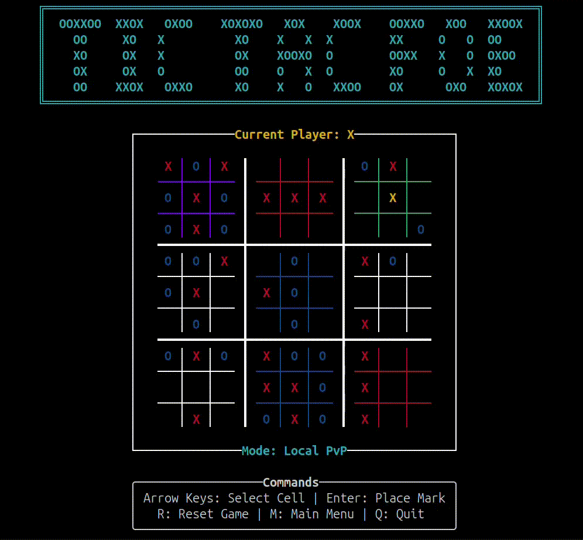

# Tic-Tac-Foe



A terminal-based Ultimate Tic-Tac-Toe game built with Rust and Ratatui.

## Features
- **Choose Mode**: Both classic and Ultimate version of tic-tac-toe are avaliable.
- **Local PvP**: Play against another person on the same computer.
- **Play vs AI**: Challenge an AI opponent.
- **AI vs AI**: Let two AI opponents fight against each other.
- **Multiple AI Options**: Choose between AIs with three different levels of strenght.
- **Monte Carlo Tree Search AI**: The strongest AI option implements the MCTS algorithm, the same used by [AlphaGo](https://en.wikipedia.org/wiki/AlphaGo). 
- **Intuitive TUI**: Clean terminal user interface with responsive keyboard navigation.

## Requirements
Linux, Windows or macOS operating system.
Installing via Cargo or from source additionally requires Rust 1.70 or higher and Cargo already installed.

## Installation and Usage

### Pre-built Binary (Recommended)

Download the appropriate binary for your platform from the [latest release](https://github.com/Cr3sp1/TicTacFoe/releases/latest):

- **Linux**: `tic-tac-foe-linux-x86_64`
- **macOS (Intel)**: `tic-tac-foe-macos-x86_64`
- **macOS (Apple Silicon)**: `tic-tac-foe-macos-aarch64`
- **Windows**: `tic-tac-foe-windows-x86_64.exe`

After downloading, you may need to make the binary executable (Linux/macOS only):

```bash
chmod +x tic-tac-foe-linux-x86_64  # or the macOS variant
```
Then run with:
```bash
./tic-tac-foe-linux-x86_64  # Linux
./tic-tac-foe-macos-x86_64  # macOS (Intel)
./tic-tac-foe-macos-aarch64 # macOS (Apple Silicon)
tic-tac-foe-windows-x86_64.exe  # Windows
```
Or just double-click the executable (only on Windows).
### Via Cargo

```bash
cargo install tic-tac-foe
```
Then run with:
```bash
tic-tac-foe
```

### From Source

```bash
git clone https://github.com/Cr3sp1/tic-tac-foe.git
cd tic-tac-foe
cargo build --release
```
Then run with:
```bash
cargo run
```

Or directly run the compiled binary:

```bash
./target/release/tic-tac-foe
```

## AI Options
We provide three AIs with different levels of strenght to play against or put against each other:

- **Weak**: Just moves randomly.
- **Medium**: Chooses winning moves if available and tries to avoid losses, but has no foresight.
- **Strong**: Uses the [MCTS](https://en.wikipedia.org/wiki/Monte_Carlo_tree_search) algorithm to choose moves that improve the chances of winning in the long run. 

## Dependencies

- [ratatui](https://github.com/ratatui-org/ratatui) - Terminal UI framework.
- [crossterm](https://github.com/crossterm-rs/crossterm) - Terminal manipulation.
- [rand](https://github.com/rust-random/rand) - Random number generation.

## License

This project is licensed under the MIT License - see the [LICENSE](LICENSE) file for details.

## Author

Developed by [Cr3sp1](https://github.com/Cr3sp1).